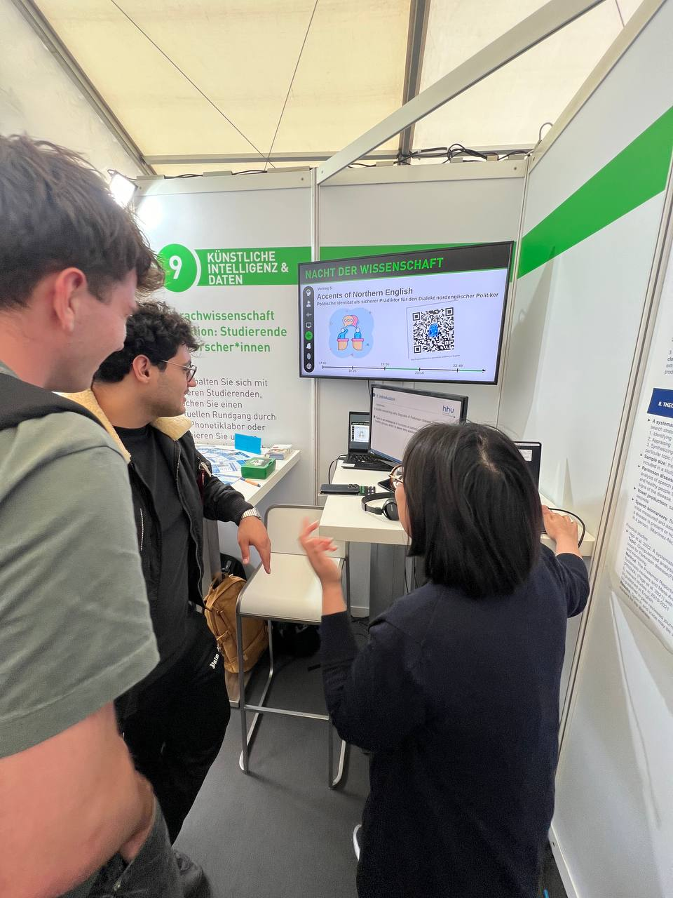
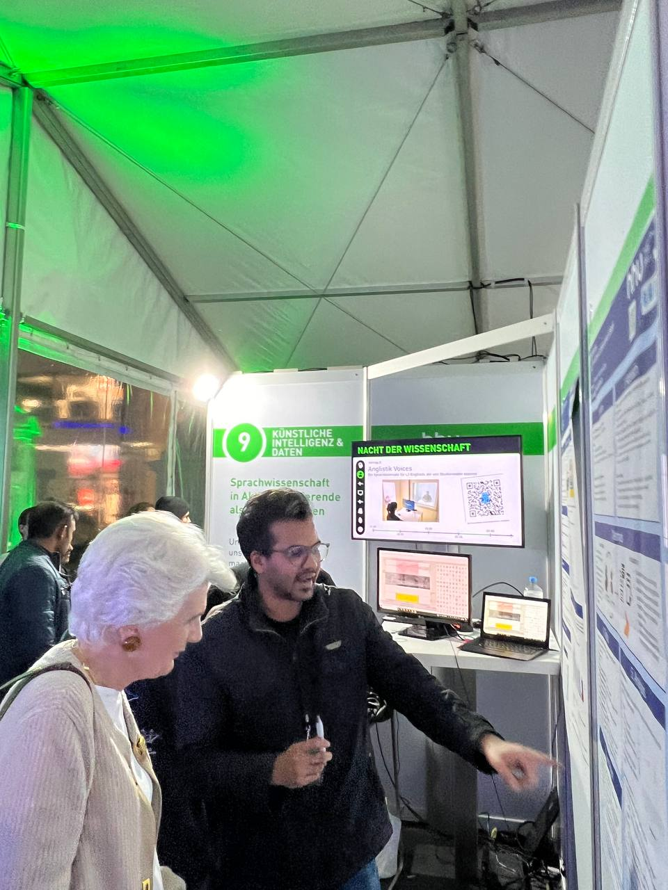
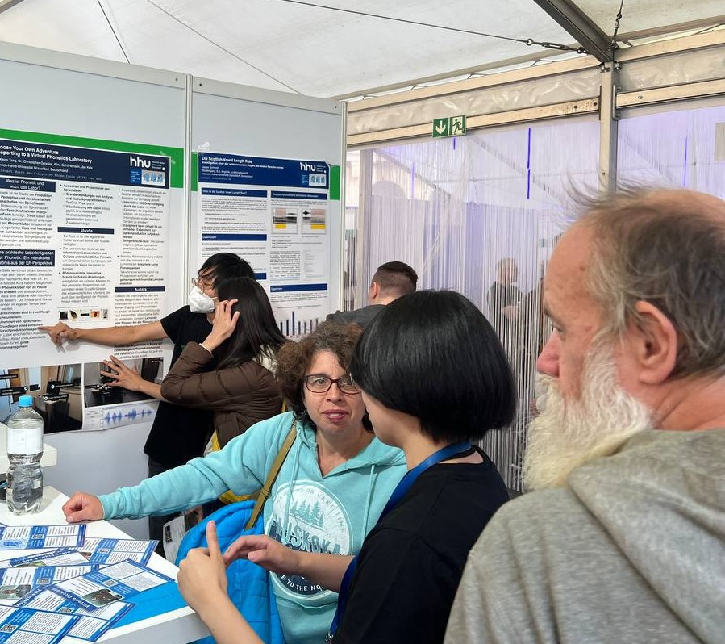
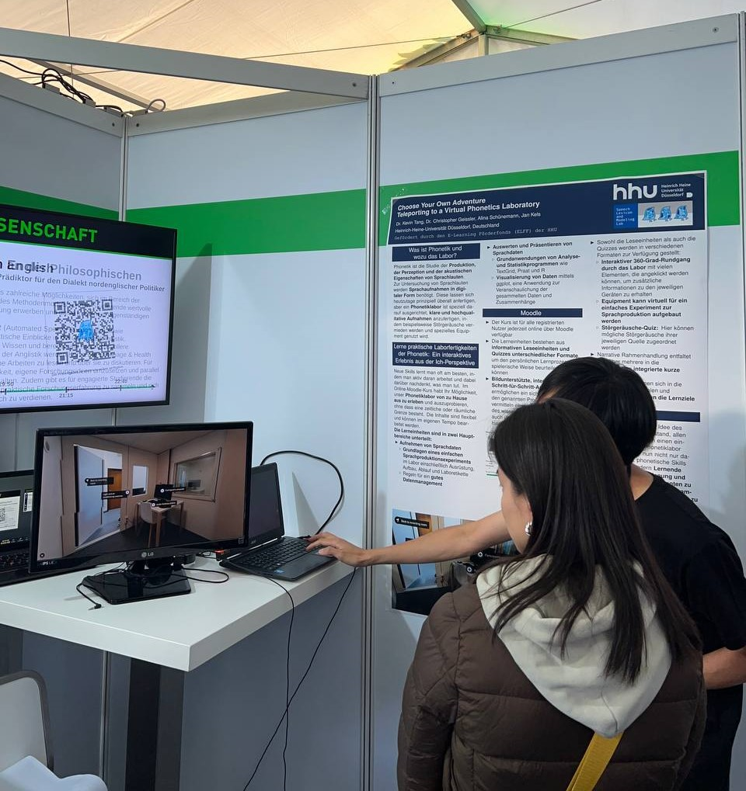
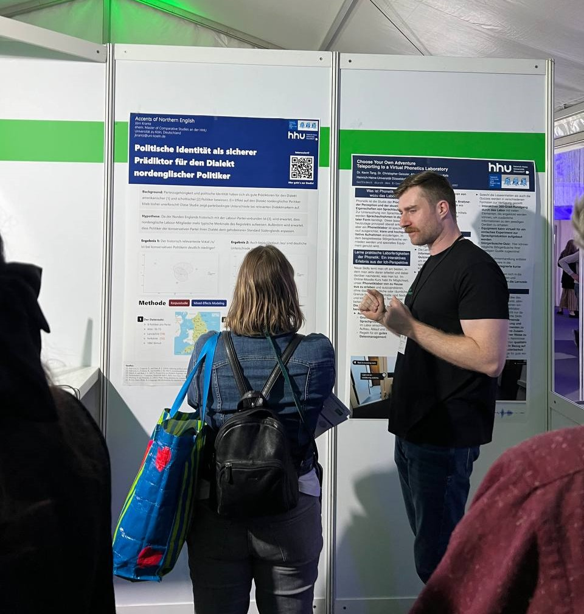

**The open science event Nacht der Wissenschaft (The Night of Science) entered its fifth edition, and we were excited to be part of it once again.**

Here’s a [virtual booth](https://slam.phil.hhu.de/ndw24/) for those who couldn’t attend the in-person event or want to explore the topics further. It provides detailed information on the presentations, along with additional resources for a deeper dive into each subject.

[The Night of Science](https://www.nachtderwissenschaft-duesseldorf.de/) is a well-established public relations event in Germany, taking place every two years. On this special night, major scientific institutions from Düsseldorf and the surrounding region gather at Schadowplatz to open their doors to the public, showcasing their latest research through lectures, interactive demonstrations, and hands-on experiments. The event offers an immersive experience, allowing citizens to explore the world of science and engage directly with researchers across a wide range of topics, from the natural to the social sciences.

## The Lab in Action

Under the motto “Sprachwissenschaft in Aktion: Studierende als Forscher*innen” (Linguistics In Action: Students As Researchers), three of our lab members and two Anglistik students presented their research projects to the general public, showcasing interdisciplinary approaches that push the boundaries of linguistics through AI, speech analysis, and innovative tools. In addition to these presentations, we displayed testimonials from Anglistik and Linguistics students, who shared their experiences as student researchers, reflecting on what it’s like to work as a research assistant and the valuable skills they have developed through their research involvement.

{% include carousel.html height="50" width="50" unit="%" duration="7" number="1" %}

## SLaM Lab’s Presentations at Nacht der Wissenschaft 2024

At this year’s Nacht der Wissenschaft, the SLAM Lab showcased five engaging presentations that explored key themes in linguistics. We examined the role of language in health, community dynamics, and identity, highlighting the innovative connections between linguistics and real-world applications.

### A Systematic Review: The Influence of Sample Size in Parkinson's Disease Detection Using Vowel Production as Speech Biomarkers

<figure style="margin: 0 auto; max-width: 100%;">
    
</figure>

In Parkinson’s disease, vowel production can serve as a key speech biomarker, as patients often display reduced loudness and altered vowel quality due to motor impairments affecting their vocal cords and articulatory muscles. For example, vowel sounds may become more distorted, and the range of vowel production may decrease. For this project, our researcher [Thu Tra](https://slam.phil.hhu.de/authors/thu-tra/), conducted a systematic review of studies published between 2013 and 2023, focusing specifically on peer-reviewed articles that use vowel production as biomarkers for Parkinson's detection. After reviewing hundreds of studies, she applied strict inclusion criteria to narrow down the selection. For the remaining articles, she examined three main questions: (1) Is there an imbalance in sample sizes between the study groups? (2) If there is an imbalance, do the researchers acknowledge or address it? (3) How does this imbalance impact the accuracy of detecting Parkinson’s disease using vowels as speech biomarkers?

### [AnglistikVoices](https://zenodo.org/records/12525952): A students-sourced L2 English speech dataset

<figure style="margin: 0 auto; max-width: 100%;">
    
</figure>

[Akhilesh](https://slam.phil.hhu.de/authors/akhilesh/) presented a newly developed speech dataset, which he created in collaboration with [Anna](https://slam.phil.hhu.de/authors/anna/) using recordings from his [course on Automatic Speech Recognition (ASR) systems](https://slam.phil.hhu.de/classes/accent-unplugged-w23/). The dataset includes a wide range of English accents, recorded and processed by students in [our phonetics laboratory](https://slam.phil.hhu.de/lab/). Designed to enhance ASR accuracy, the dataset provides valuable insights into the challenges ASR systems encounter when processing diverse speech patterns, supporting advancements in voice technology and linguistics research. Additionally, creating the dataset served as hands-on training for students in speech technology, phonetics, and phonology, as they analyzed ASR system errors for their final examination.

### The Vowel Length Rule in Scottish English

<figure style="margin: 0 auto; max-width: 100%;">
    
</figure>

Anglistik student Jasper presented his work on the Scottish Vowel Length Rule (SVLR), a phonological rule that determines the length of Scottish vowels. There are three places where SVLR applies and lengthens the vowels: immediately in front of voiced fricatives, in front of the voiced alveolar trill (/r/) and at morpheme boundaries. For instance the high front vowel in agreed ([əɡriːd]) is long but short in greed ([grid]). However, whether it applies to all Scottish vowels or only to a subset has been the subject of debate in research for decades, which is why Jasper has devoted himself to this question.

### [Choose Your Own Adventure: Teleporting to a Virtual Phonetics Laboratory](https://slam.phil.hhu.de/projects/elff_phonetics_adventure/)

<figure style="margin: 0 auto; max-width: 100%;">
    
</figure>

Our lab professor, [Kevin](https://slam.phil.hhu.de/authors/kevin/), showcased an innovative, interactive digital eLearning course at the event, developed in collaboration with [Alina](https://slam.phil.hhu.de/authors/alina/) and former lab members [Jan](https://slam.phil.hhu.de/authors/jan/), [Chris](https://slam.phil.hhu.de/authors/chris/) and [Eoin](https://slam.phil.hhu.de/authors/eoin/). This course allows visitors to explore phonetics laboratory equipment and setup through detailed visuals and interactive elements. Students can engage with the content, simulating real-life tasks and enhancing their understanding before entering the actual lab. Integrated quizzes provide immediate feedback, reinforcing learning and helping students identify areas for improvement. By using this course, students build confidence in navigating the lab and handling equipment, ultimately preparing them for more effective practical sessions and optimizing class time.

### Political Alignment as predictor for the dialect of Northern English Politicians

<figure style="margin: 0 auto; max-width: 100%;">
    
</figure>

Former Anglistik student Jörn presented his research on Northern English accents, exploring whether the party affiliation of Members of Parliament influences their accent variation, and how their educational background impacts it. He hypothesized that Conservative speakers would exhibit more features characteristic of Received Pronunciation, while working-class speakers would display more Northern English features. Additionally, he proposed that privately educated speakers would show greater alignment with Received Pronunciation, whereas publicly educated speakers would demonstrate more traits typical of Northern English accents.

## Testimonials from our students

In advance to the event, we asked our linguistics students and the general linguistics student about their experiences as research students. We asked them to share their experiences as part-time researchers and what skills they have acquired or developed during their research journals. The students who responded to us include both B.A. students in English studies and M.A. students in General Linguistics, as well as PhD students in English Studies and General Linguistics. Many thanks to all of you for your contributions!

{% include carousel.html height="50" width="50" unit="%" duration="7" number="2" %}

Finally, we would like to thank all those involved once again: thanks to Akhilesh, Tra, Jasper, Jörn and Kevin for agreeing to bring the science of linguistics closer to the general public with their projects, and [Vittorio](https://slam.phil.hhu.de/authors/vitto/), [Dalia](https://slam.phil.hhu.de/authors/dalia/) and Kevin for organizing and coordinating our stand at the event.
